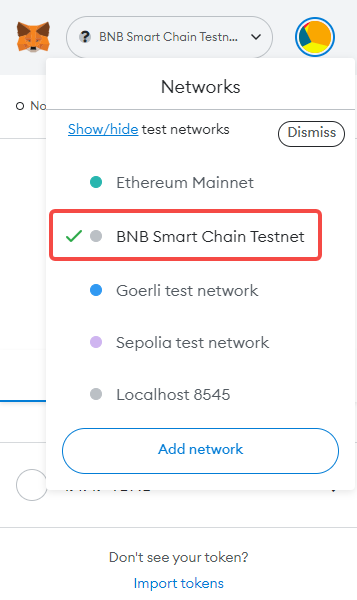

# taxi

## environment 

- Install [Cocos Creator 3.6.2](https://www.cocos.com/)

- Change your [metamask wallet](https://metamask.io/) Networks to [BNB Smart Chain Testnet](https://testnet.bscscan.com/
)

- Get Some [TBNBs](https://testnet.bnbchain.org/faucet-smart)

- Run `assets\login.scene` in Cocos Creator

- (option) you can build the `./contracts/` in [http://remix.ethereum.org](http://remix.ethereum.org), and change config in `./assets/resources/datas/ethers.json`
